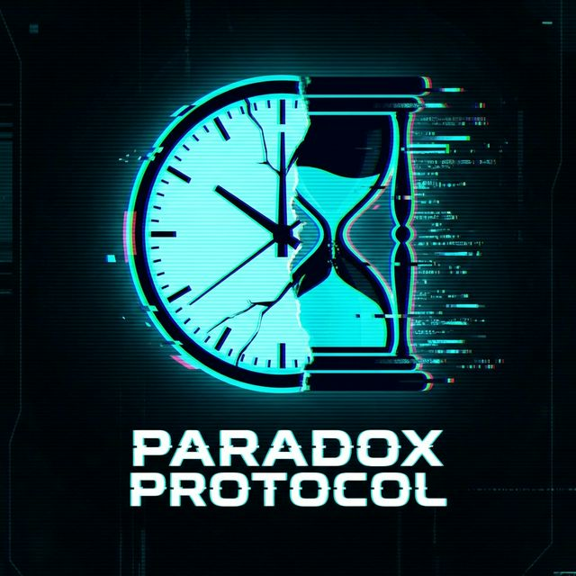

# Paradox Protocol

> **"Perfection is the only option."**
> A single-file, zero-dependency tactical puzzle game where time is your weapon and your cage.

## 🕹️ Game Versions

| **v2.0 (Latest)** | **v1.0 (Original)** |
| :---: | :---: |
|  |  |
| [**Execute v2.0**](https://ritikiitg.github.io/paradox-protocol/v2/) | [**Access v1.0**](https://ritikiitg.github.io/paradox-protocol/v1/) |

## 🕹️ About The Game

**Paradox Protocol** deconstructs the traditional rogue-like. Instead of speed or brute force, your greatest enemy is your own mistakes.

Inspired by *Superhot*'s time mechanics and the high-tension aesthetics of *Cyberpunk 2077*, we created a "glitch-horror" atmosphere where you must strictly follow a **Protocol**.

*   **The Hook:** Time stands still as long as you follow the Directive (e.g., "Step on Blue").
*   **The Twist:** If you make a mistake (hit a wall, wrong color), **Time Advances**. Enemies (Sentinels) move, hunt, and corner you.
*   **The Goal:** Reach the Rift to escape the sector before you are erased.

## ✨ Key Features

*   **📦 Single-File Architecture**: The entire game is contained in one `index.html` file. No bundlers, no installs, no external assets.
*   **🔊 Real-Time Audio Synthesis**: A custom Web Audio API engine generates all sound effects (drones, glitches, chimes) mathematically on the fly.
*   **🎨 Dynamic Visuals**: A high-performance Canvas particle system overlays the React UI for premium effects like sparks, vortexes, and snow.
*   **👁️ "Cyber-Eye" AI**: Enemy sentinels physically track your position on screen, adding to the immersion.
*   **🏆 Local Leaderboard**: Persistent tracking of the most elite agents.

## 🚀 Quick Start

1.  **Clone** this repository.
    ```bash
    git clone https://github.com/ritikiitg/paradox-protocol.git
    ```
2.  **Open** `game.html` in any modern web browser.
3.  **Play**. That's it.

## 🌍 Deployment

Played live at: [HERE](https://ritikiitg.github.io/paradox-protocol/)

## 🎮 How to Play

1.  **Read the Directive**: The HUD will tell you what to do (e.g., "STEP ON RED" or "AVOID BLUE").
2.  **Move**: Use `Arrow Keys` or `WASD` to move.
3.  **Survive**:
    *   **Correct Move**: Time stays frozen. You are safe.
    *   **Wrong Move**: Time advances. Enemies take a step towards you.
4.  **Escape**: Reach the **Vortex** at the end of the level to advance to the next Sector.

## 🛠️ Built With

We challenged ourselves to build this without a build step.

*   **Core**: HTML5, JavaScript (ES6+)
*   **UI**: React 18 (via CDN), Tailwind CSS (via CDN)
*   **Audio**: Web Audio API (Oscillators, Gain Nodes)
*   **Graphics**: HTML5 Canvas API (Particle System)
*   **Storage**: LocalStorage API

## 📄 License

Distributed under the MIT License. See `LICENSE` for more information.
